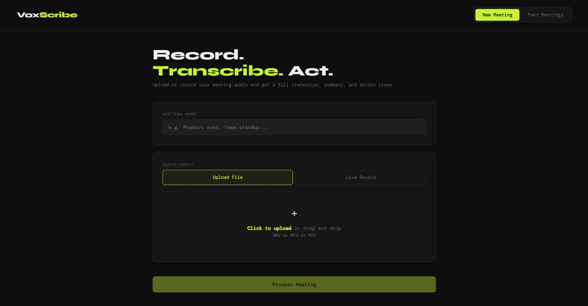
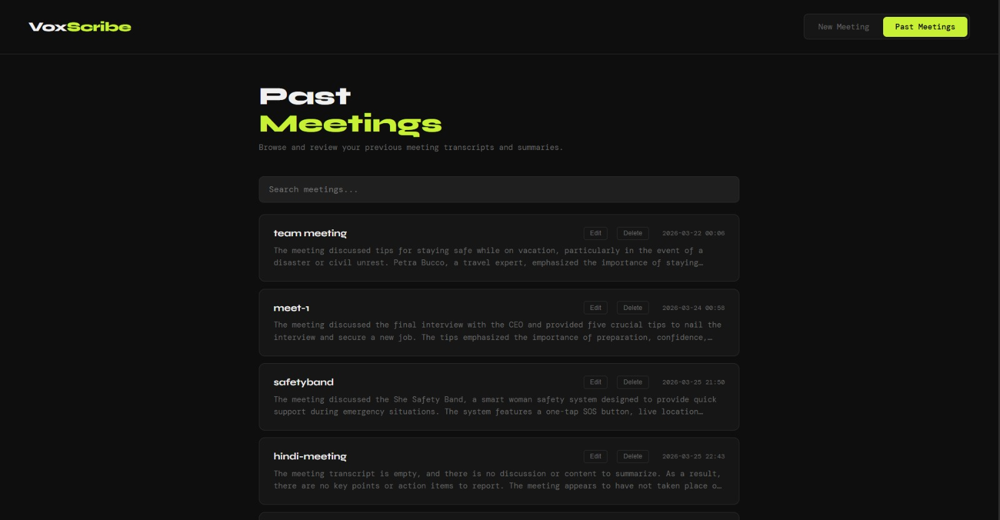
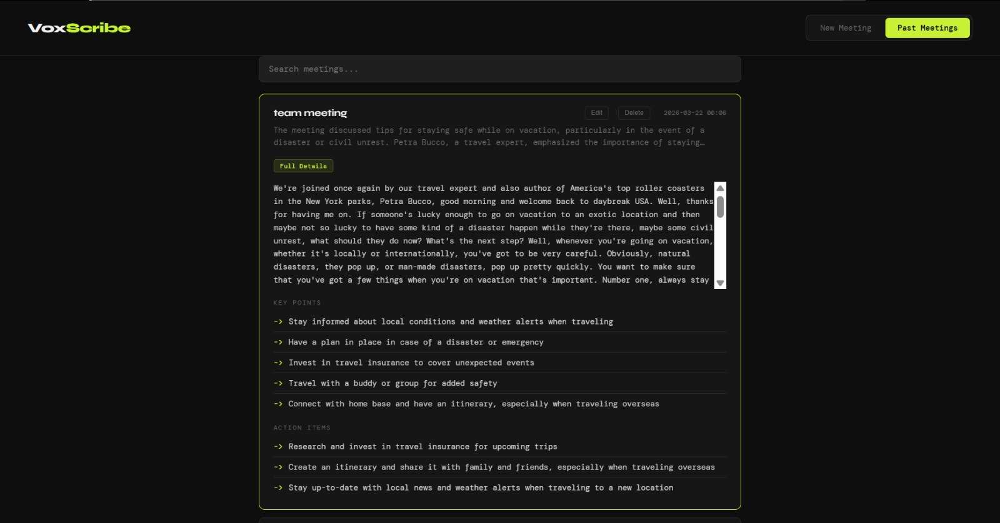
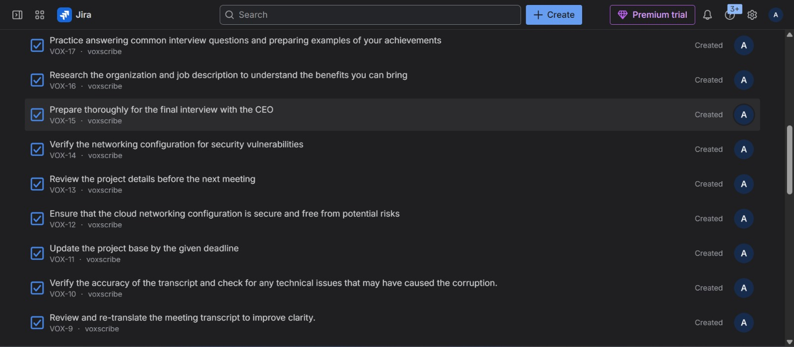

# VoxScribe

An AI-powered meeting assistant that transcribes audio, detects the language, identifies speakers, and automatically extracts summaries, key points, and action items. Action items are pushed directly to Jira as tasks.

---

## Features

- Upload meeting audio (WAV, MP3, MP4) or record live from the browser  
- Transcribes audio using Whisper running locally  
- Detects the spoken language automatically, including Indian languages like Hindi, Kannada, Tamil, Telugu and more  
- Generates a concise summary, key points, and action items using Groq (llama3)  
- Automatically creates Jira tasks for each action item extracted from the meeting  
- Stores all meetings in MongoDB for later reference  
- Search across past meetings by name or summary  
- Clean dark UI served directly from FastAPI  

---

### New Meeting Page

### Past Meetings

### Summary Page

### Tasks Board

---

## What It Does

- Converts meeting audio into structured insights  
- Extracts key decisions and action items  
- Helps teams stay aligned and productive  
- Automates task creation in Jira  

---

## Tech Stack

- FastAPI - backend API  
- faster-whisper - local speech to text  
- Groq API (llama3) - summarization and action item extraction  
- Jira API - automatic task creation from action items  
- MongoDB - meeting storage  
- Vanilla HTML/CSS/JS - frontend  
- pyannote.audio - speaker diarization (in progress)  

---

## 📂 Project Structure

    voxscribe/
    ├── api/
    │   └── main.py
    ├── app/
    │   └── ui.py
    ├── core/
    │   ├── transcribe.py
    │   ├── diarize.py
    │   ├── combine.py
    │   ├── summarize.py
    │   ├── database.py
    │   └── jira_sync.py
    ├── static/
    │   └── index.html
    ├── data/
    │   └── audio/
    ├── .env.example
    └── requirements.txt

---

## Setup

### 1. Clone the repo

    git clone https://github.com/yourusername/voxscribe.git
    cd voxscribe

---

### 2. Install dependencies

    pip install -r requirements.txt

---

### 3. Install FFmpeg

Download from https://ffmpeg.org and add it to PATH.

---

### 4. Set up environment variables

    cp .env.example .env

    HF_TOKEN=your_huggingface_token
    GROQ_API_KEY=your_groq_api_key
    MONGO_URI=mongodb://localhost:27017
    JIRA_URL=https://yourworkspace.atlassian.net
    JIRA_USERNAME=your_email@example.com
    JIRA_API_TOKEN=your_jira_api_token
    JIRA_PROJECT_KEY=your_project_key

---

### 5. Start MongoDB

Make sure MongoDB is running locally on port 27017.

---

### 6. Run the server

    uvicorn api.main:app --reload --port 8000

Open http://localhost:8000/ui in your browser.

---

## API Endpoints

| Method | Endpoint | Description |
|--------|----------|-------------|
| POST | /upload | Upload audio file and process meeting |
| POST | /record | Process live recorded audio |
| GET | /meetings | List all past meetings |
| GET | /meetings/{id} | Get full details of a meeting |

---

## Environment Variables

| Variable | Description |
|----------|-------------|
| HF_TOKEN | Hugging Face token |
| GROQ_API_KEY | Groq API key |
| MONGO_URI | MongoDB URI |
| JIRA_URL | Jira workspace URL |
| JIRA_USERNAME | Jira email |
| JIRA_API_TOKEN | Jira token |
| JIRA_PROJECT_KEY | Jira project key |

---

## Notes

- First run downloads Whisper model (~1.5GB)  
- CPU processing may take time  
- Speaker diarization requires HuggingFace access  
- Supports 99+ languages  

---

## License

MIT License
